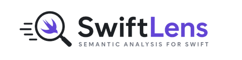

<p align="center">
  <picture >
    <source media="(prefers-color-scheme: dark)" srcset="docs/swiftlens-logo-horizontal-dark.png">
    <source media="(prefers-color-scheme: light)" srcset="docs/swiftlens-logo-horizontal-light.png">
    
  </picture>
</p>

**SwiftLens** detects SwiftUI architectural drift before it reaches code review or CI.

It uses deterministic syntax-tree heuristics instead of full semantic compiler analysis.

SwiftLens is designed for teams that want lightweight governance enforcement with machine-readable output.

SwiftLens currently targets Apple Silicon macOS environments.

## Why SwiftLens

Most Swift architecture tooling eventually becomes:

- semantic-heavy
- difficult to maintain
- slow to execute
- tightly coupled to compiler behavior

SwiftLens intentionally takes a narrower approach:

- syntax-tree-first heuristics
- deterministic findings
- CI-friendly JSON output
- lightweight governance enforcement
- explicit architectural boundaries

## Quick Example

```bash
swiftlens scan Sources --format json
```

```json
{
  "rule": "architecture.forbidden-import",
  "severity": "error",
  "path": "Features/Profile/ProfileView.swift",
  "reason": "Feature layer imports Infrastructure"
}
```

## Installation

### Release installer

Requirements:

- macOS
- Apple Silicon (`arm64`)
- Swift 6+

```bash
curl -fsSL https://raw.githubusercontent.com/davinaizer/swiftlens/main/scripts/install.sh | sh
```

This installs the release version defined in `Sources/SwiftLens/Version.generated.swift` by default. Set `SWIFTLENS_INSTALL_VERSION` if you need a different release.

```bash
swiftlens version
```

### Swift Package Manager fallback

```bash
git clone https://github.com/davinaizer/swiftlens.git
cd swiftlens
swift build -c release
```

## Quick Start

```bash
swiftlens
```

```bash
swiftlens scan
```

```bash
swiftlens scan Sources --format json
```

```bash
swiftlens validate-config
```

## CLI

Supported commands:

```text
swiftlens
swiftlens scan
swiftlens validate-config
swiftlens version
swiftlens help
```

Supported flags:

```text
--config
--format
--path
--verbose
```

## Behavior Guarantees

| Capability          | Behavior                                   |
| ------------------- | ------------------------------------------ |
| Default scan target | `.`                                        |
| Default format      | `json`                                     |
| Config resolution   | cwd-local `.swiftlens.yml` only            |
| Config precedence   | explicit `--config` overrides local lookup |
| Exit code `0`       | success                                    |
| Exit code `1`       | rule violations                            |
| Exit code `2`       | config or usage error                      |
| Exit code `3`       | internal failure                           |

## What SwiftLens Detects

SwiftLens focuses on deterministic governance signals:

- path-boundary violations
- import/domain restrictions
- SwiftUI naming and location drift
- lightweight architectural heuristics
- configurable governance rule packs

## Configuration

SwiftLens reads `.swiftlens.yml` from the current working directory unless you pass `--config`.

Supported top-level keys:

- `project`
- `packs`
- `rules`

Supported `project` fields:

- `path`
- `include`
- `exclude`

Supported `packs.architecture` fields:

- `enabled`
- `severityOverrides`

Supported `rules.ForbiddenImportRule` fields:

- `enabled`
- `config.forbiddenImports`

Example configuration:

```yaml
project:
  path: .
  include: []
  exclude:
    - .build/**
    - .swiftlens-bin/**
    - dist/**
    - DerivedData/**
packs:
  architecture:
    enabled: true
    severityOverrides:
      # leave empty unless overriding rule severities
rules:
  ForbiddenImportRule:
    enabled: true
    config:
      forbiddenImports:
        - UIKit
```

## Architecture Principles

SwiftLens is intentionally:

- deterministic
- syntax-tree-first
- phase-gated
- CI-compatible
- lightweight by design

## Non-Goals

SwiftLens is intentionally not:

- a semantic compiler analyzer
- a generalized Swift linter
- a plugin platform
- an IDE automation tool
- an architecture visualization system
- an AI coding assistant

## Current Status

| Phase    | Status     |
| -------- | ---------- |
| Phase 1  | Complete   |
| Phase 2  | Complete   |
| Phase 3A | Complete   |
| Phase 4  | Authorized |

Current implementation includes:

- deterministic rule registry
- built-in governance rules
- fixture-backed tests
- local-first developer DX
- machine-readable reporting

## Development

Run tests:

```bash
CLANG_MODULE_CACHE_PATH=/private/tmp/swiftlens-cache swift test
```

Run SwiftLint:

```bash
swiftlint lint
```

Link a local build into a repo-local shim directory so it wins on `PATH`:

```bash
./scripts/dev-link.sh link
export PATH="$PWD/.swiftlens-bin:$PATH"
swiftlens --version
```

Remove the local shim:

```bash
./scripts/dev-link.sh unlink
```

SwiftLens development is:

- governance-driven
- TDD-enforced
- phase-gated
- deterministic by contract

Additional architectural and governance documentation lives in [`docs/`](docs/).

## Maintainer Release Guide

Prerequisites:

- Swift toolchain
- `tar`
- authenticated `gh` (`gh auth login`)

1. Pick the release version, write the release version source, and tag it:

```bash
./scripts/write-release-version-source.sh vX.Y.Z
git add Sources/SwiftLens/Version.generated.swift
git commit -m "chore: prepare vX.Y.Z"
git tag vX.Y.Z
```

2. Build and validate the macOS Apple Silicon archive locally:

```bash
./scripts/package-release.sh
```

This creates:

- `dist/swiftlens-macos-arm64.tar.gz`

SwiftLens release artifacts currently target Apple Silicon macOS only.

3. Upload the archive to the GitHub release:

```bash
./scripts/upload-release.sh vX.Y.Z
```

To verify the upload flow first:

```bash
./scripts/upload-release.sh vX.Y.Z --dry-run
```

Publish the GitHub release as a normal release, not a pre-release, so the installer URL resolves correctly.

4. Installers can then fetch the asset with:

```bash
curl -fsSL https://raw.githubusercontent.com/davinaizer/swiftlens/main/scripts/install.sh | sh
```

## Repository Layout

```text
swiftlens/
├── Sources/
├── Tests/
├── docs/
├── examples/
├── scripts/
└── README.md
```

## Contributing

Contributions must preserve:

- deterministic behavior
- lightweight architecture
- syntax-tree-first analysis
- phase contract compliance

Review repository governance documents before contributing.

## License

MIT
